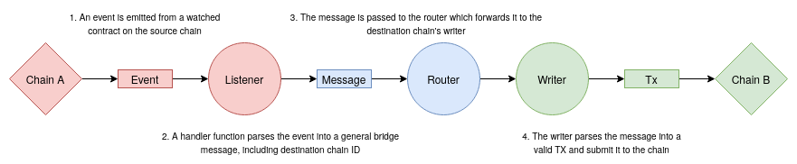

# 🌉 <b> Overview </b>

## Summary

ChainBridge is an extensible cross-chain communication protocol. It currently supports bridging between EVM and Substrate based chains.

A bridge contract (or pallet in Substrate) on each chain forms either side of a bridge. Handler contracts allow for customizable behavior upon receiving transactions to and from the bridge. For example locking up an asset on one side and minting a new one on the other. Its highly customizable - you can deploy a handler contract to perform any action you like.

In its current state ChainBridge operates under a trusted federation model. Deposit events on one chain are detected by a trusted set of off-chain relayers who await finality, submit events to the other chain and vote on submissions to reach acceptance triggering the appropriate handler.

Research is currently underway to reduce the levels of trust required and move toward a fully trustless bridge.

## Relevant repos

### [chainbridge-core](https://github.com/ChainSafe/chainbridge-core)
The chainbridge-core was born from the existing version of ChainBridge in efforts to improve the maintainability and modularity of the current solution. The fundamental distinction between chainbridge-core and [ChainBridge](https://github.com/ChainSafe/chainbridge) is that chainbridge-core is more of a framework rather than a stand-alone application.

### [chainbridge-core-example](https://github.com/ChainSafe/chainbridge-core-example)
The core-example is an example CLI of running a bridge with the chainbridge-core framework.

### [chainbridge-celo-module](https://github.com/ChainSafe/chainbridge-celo-module)
This module brings support of a Celo compatible client module. Chainbridge-celo-module is part of chainbridge-core framework.

### [chainbridge-solidity](https://github.com/ChainSafe/chainbridge-solidity) 
The Solidity contracts required for ChainBridge. Includes deployment and interaction CLI.
